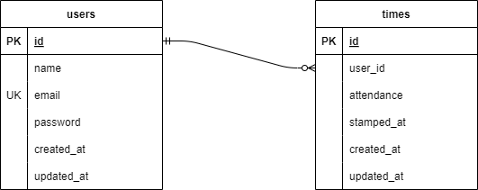

# Atte(勤怠管理システム)

## 環境構築
### Dockerビルド
1．git clone リンク

2．DockerDesktopアプリを立ち上げる

3．docker-compose up -d --build

* MySQLは、docker-compose.ymlファイルを編集する。

### Laravel環境構築
1．docker-compose exec php bash

2．⁠composer install

3．.env.exampleファイルから.envファイルを作成し、環境変数を変更

4．php artisan key:generate

5．⁠php artisan migrate

6．php artisan db:seed

## 使用技術(実行環境)
・PHP 8.1.29

・Laravel 10.48.20

・MySQL 8.0.26

## ER図

## URL
・ 開発環境：http://localhost/

・ phpMyAdmin：http://localhost:8080
